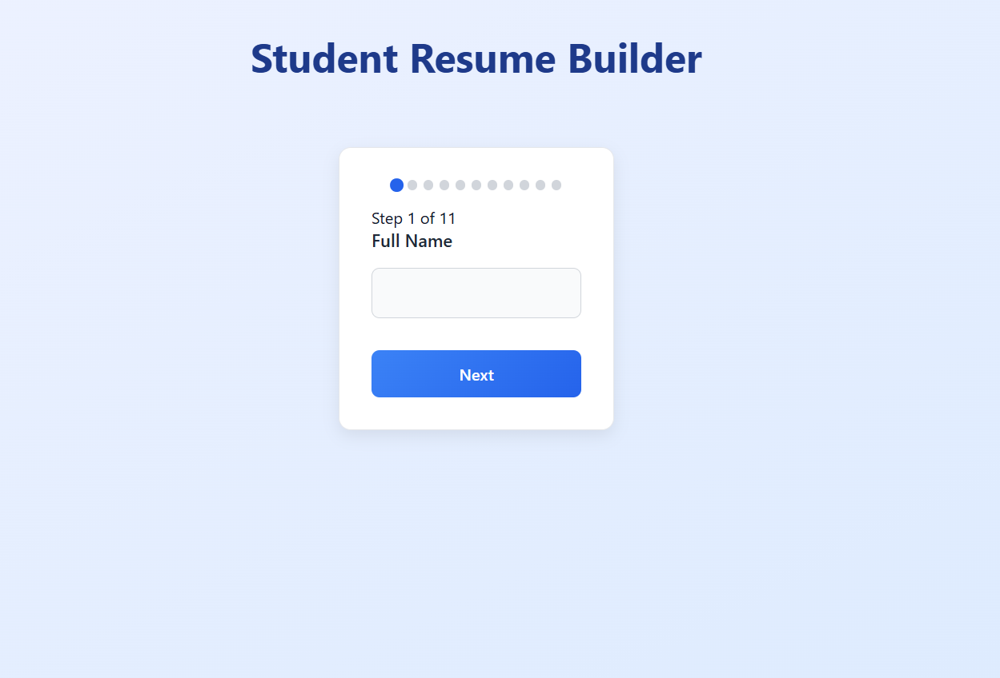

# 📝 Resume Builder App


A modern, interactive **Resume Builder** built with **React** that helps students and professionals generate customized resumes easily. The app guides users through a series of questions and dynamically generates a clean, professional resume.

---

## 📑 Table of Contents

* [🚀 Overview](#-overview)
* [✨ Features](#-features)
* [🛠️ Tech Stack](#%EF%B8%8F-tech-stack)
* [⚙️ Installation](#%EF%B8%8F-installation)
* [▶️ Usage](#%EF%B8%8F-usage)
* [📸 Screenshots](#-screenshots)
* [🤝 Contributing](#-contributing)
* [📜 License](#-license)

---

## 🚀 Overview

This Resume Builder app provides a **step-by-step form-based interface** for users to input their personal details, skills, education, and experience.
It then automatically generates a well-structured resume based on the provided data.

The project is designed to be **simple, fast, and responsive**, making resume building effortless for students and professionals alike.

---

## ✨ Features

* ✅ **Interactive Question-based Form** – Collects user data step-by-step
* ✅ **Dynamic Resume Generation** – Creates a clean, ready-to-download resume
* ✅ **Auto Skill Suggestions** – Smart skill suggestions as you type
* ✅ **Language & Proficiency Selector** – Easily add multiple languages and levels
* ✅ **Responsive Design** – Works across devices (desktop, tablet, mobile)
* ✅ **Smooth Animations** – Framer Motion transitions for a modern UI

---

## 🛠️ Tech Stack

* **Frontend:** React (Vite), CSS3, Framer Motion
* **Backend:** Node.js, Express (for AI-powered summary generation)
* **Database:** (Optional future integration: MongoDB)
* **Version Control:** Git & GitHub

---

## ⚙️ Installation

1. **Clone the repository**

   ```bash
   git clone https://github.com/SammyBGH/Resume-Builder.git
````

2. **Navigate into the project directory**

   ```bash
   cd resume-builder
   ```
3. **Install dependencies**

   ```bash
   npm install
   ```
4. **Start the development server**

   ```bash
   npm run dev
   ```
5. **(Optional)** Start the backend server (if using AI summary)

   ```bash
   cd server
   npm install
   npm start
   ```

---

## ▶️ Usage

1. Open the app in your browser (usually at `http://localhost:5173`).
2. Fill out the interactive form step by step.
3. View your generated resume in real-time.
4. Download or print your resume.

---

## 📸 Screenshots

### 1️⃣ Main App Interface (Form with Questions)



---

### 2️⃣ Generated Resume Preview


---

## 🤝 Contributing

Contributions are welcome under the following conditions:

* 🐛 **Bug Reports:** If you find issues or errors, feel free to open an issue.
* 💡 **Feature Suggestions:** You may suggest improvements or enhancements.
* 🔥 **Pull Requests:** Only for bug fixes or non-commercial improvements.

⚠️ **Note:**
Due to the license restrictions (**CC BY-NC-ND 4.0**):

* ❌ You are **not allowed** to copy, modify, or redistribute this code for your own projects or commercial use.
* ✅ You may only contribute fixes or suggestions that help improve this repository directly.

---

## 📜 License

This project is licensed under the **Creative Commons Attribution-NonCommercial-NoDerivatives 4.0 International License (CC BY-NC-ND 4.0)**.

* ✅ You may **view and reference** this project for personal or educational purposes.
* ❌ You may **NOT copy, modify, redistribute, or use** this code for commercial purposes without explicit permission from the author.

See the full license terms here: [CC BY-NC-ND 4.0 License](https://creativecommons.org/licenses/by-nc-nd/4.0/)

---

### 🌟 Show Your Support

If you find this project useful, don't forget to ⭐ **star the repo** to help others discover it!

